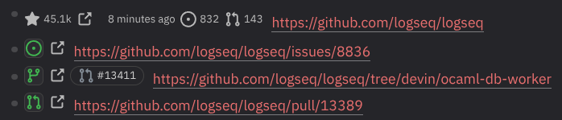

# Git Forge Watcher

A [Logseq](https://logseq.com) plugin that watches GitHub repos, branches, issues and pull requests, rendering their live status inline inside your blocks.

Run one of its slash commands on a block that contains a GitHub link and it drops a small widget between the bullet and the block's text: a status icon coloured by the current state, plus a link out to GitHub. Click the icon to force a refresh.



## What it does

The plugin adds four slash commands, one per kind of GitHub link. Each one reads the link out of the block, prepends a renderer macro, and draws an inline widget at the start of the block (or the end, if you flip its "insert at start" setting off).

### Git Forge Watcher - Repo

For a block containing any `github.com/<owner>/<repo>` link (any deeper link — `.../tree/x`, `.../pull/1`, `.../issues/2` — resolves to its repo root), it renders a card with:

- ⭐ **star count**, compacted the way GitHub does (`1.2k`, `12.3k`, `2.1m`)
- a link out to the repository
- the **last commit's** relative age, linking to the default branch's commit history
- **open issue** and **open pull request** counts, each linking to the matching tab

### Git Forge Watcher - Branch

For a block containing a `github.com/<owner>/<repo>/tree/<branch>` link, e.g.

```
[`logseq/upgrade-tailwind-base-ui`](https://github.com/logseq/logseq/tree/logseq/upgrade-tailwind-base-ui)
```

it renders:

- **A branch button** (GitHub's branch octicon), coloured by status:
  - 🟢 **green** — active (the branch exists and was committed to recently)
  - 🟡 **yellow** — stale (last commit older than the stale threshold)
  - 🔴 **red** — deleted (the branch no longer exists on GitHub)
- **Pull-request pills** for every PR opened from that branch, each showing the PR number and an icon coloured by state:
  - 🟢 green — open · ⚪ grey — draft · 🔴 red — closed · 🟣 purple — merged

### Git Forge Watcher - Issue

For a block containing a `github.com/<owner>/<repo>/issues/<number>` link (any trailing `#issuecomment-…` anchor is ignored), it renders an **issue button** coloured by state, plus a link out to the issue:

- 🟢 **green** — open
- 🟣 **purple** — closed as completed
- ⚪ **grey** — closed as not planned

### Git Forge Watcher - Pull Request

For a block containing a `github.com/<owner>/<repo>/pull/<number>` link, it renders a **pull-request button** coloured by state, plus a link out to the PR:

- 🟢 **green** — open
- ⚪ **grey** — draft
- 🔴 **red** — closed
- 🟣 **purple** — merged

Status is read live from the GitHub REST API. Every widget's status icon (or, for the repo widget, its star button) is also a button: click it to force an immediate refresh, bypassing the cache.

## Usage

1. Put your cursor in a block that contains the relevant GitHub link.
2. Type `/` and choose the matching command — **Git Forge Watcher - Repo**, **- Branch**, **- Issue**, or **- Pull Request**.

The command prepends a `{{renderer :gfw-repo, …}}` (or `:gfw-branch` / `:gfw-issue` / `:gfw-pr`) macro to the block, which renders the widget inline. Works on both DB graphs (reads `block/title`) and legacy file graphs (reads `block/content`).

## Caching & offline behaviour

Status is cached in the plugin's `localStorage`, so it persists across restarts and is shared across graphs (GitHub status is global, not graph-specific). Multiple blocks referencing the same repo/branch/issue/PR coalesce into a single API request.

- Within the cache TTL (default **24 hours**), widgets render instantly from cache with no network call.
- Once the TTL expires, the next render re-queries GitHub.
- If that refresh fails — you're offline, rate-limited, or GitHub errors — the widget falls back to the **last known state**, shown dimmed with an "Offline — showing last known state" tooltip, rather than an error.
- Clicking a status icon always forces an immediate refresh.

## Settings

| Setting | Default | Description |
| --- | --- | --- |
| **GitHub token** | _(empty)_ | Optional personal access token. Raises the API rate limit and allows reading repos/branches/issues/PRs in private repos. |
| **Stale threshold (days)** | `30` | A branch whose last commit is older than this many days shows yellow (stale) instead of green (active). |
| **Prefer last URL** | `false` | When a block contains more than one matching GitHub link, slash commands use the first one by default; enable this to use the last one instead. |
| **Cache TTL (hours)** | `24` | How long repo/branch/issue/PR status is cached before re-querying GitHub. Click a status icon to force an immediate refresh. |
| **Repo widget at start of block** | `true` | Insert the repo renderer at the start of the block. Turn off to append it at the end instead. |
| **Branch widget at start of block** | `true` | Insert the branch renderer at the start of the block. Turn off to append it at the end instead. |
| **Issue widget at start of block** | `true` | Insert the issue renderer at the start of the block. Turn off to append it at the end instead. |
| **Pull request widget at start of block** | `true` | Insert the pull request renderer at the start of the block. Turn off to append it at the end instead. |

Without a token the plugin uses GitHub's unauthenticated rate limit (60 requests/hour per IP), which is fine for light use but may throttle on large graphs.

## Install

### From source (developer mode)

```sh
bun install
bun run build
```

In Logseq, enable **Developer mode** (Settings → Advanced), then **Load unpacked plugin** and point it at this project root.

### Develop with hot reload

```sh
bun install
bun run dev
```

`bun run dev` starts Vite in dev mode; thanks to [`vite-plugin-logseq`](https://github.com/pengx17/vite-plugin-logseq), edits to `src/` hot-reload inside Logseq without reloading the unpacked plugin.

## Project layout

```
src/
  index.ts         # plugin entry: registers the slash commands + macro renderers
  slash.ts         # the four "Git Forge Watcher - …" slash commands
  render-repo.ts   # builds the inline repo widget (stars, last commit, issue/PR counts)
  render-branch.ts # builds the inline branch widget (status + PR pills)
  render-issue.ts  # builds the inline issue widget
  render-pr.ts     # builds the inline pull-request widget
  github.ts        # GitHub REST client: repo facts, branch status, PRs, issue/PR state
  parse-repo.ts    # extracts owner/repo from any GitHub link
  parse-branch.ts  # extracts owner/repo/branch from a tree link
  parse-issue.ts   # extracts owner/repo/number from an issues link
  parse-pr.ts      # extracts owner/repo/number from a pull link
  cache.ts         # localStorage TTL cache + in-flight request dedupe
  icons.ts         # GitHub octicon SVGs (branch / PR / issue states)
  settings.ts      # plugin settings schema (token, stale threshold, cache TTL, per-command placement)
  handle-popup.ts  # Esc / click-outside dismiss helpers
index.html         # Vite entry consumed by Logseq
vite.config.ts     # registers vite-plugin-logseq
biome.json         # formatter + linter config
```

## License

MIT
